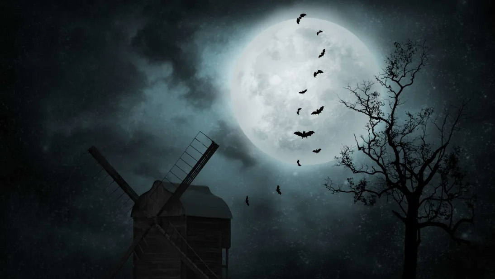

# A Rare Blue Moon Will Light Up the Night Sky This Halloween

Wolves, werewolves, and people dressed as werewolves will have a bona fide full moon to howl at this Halloween. And it’s not just any full moon—it’s a blue moon.

## WHAT IS A BLUE MOON?
Since a complete lunar cycle is 29.5 days long, this usually works out to one full moon per calendar month. If a full moon occurs on the first or second day of the month, however, there could technically be another one within the same month. When that happens—about once every 2.5 to 3 years, according to the Farmers’ Almanac—the second full moon is called a “blue moon.”

But up until the mid-20th century, blue moons had a different definition. The Maine Farmers’ Almanac and similar publications used to count full moons by season, so a year with 13 full moons meant that one season would have four (not three) full moons. To avoid messing with full moon nicknames that were tied to certain times of year (e.g. the “moon before Yule”), the third full moon in a season of four was named a “blue moon.”

In a 1943 column for Sky & Telescope, Laurence J. Lafleur mentioned that blue moons occur when a year has 13 full moons, but he didn’t go into detail about how the Maine Farmers’ Almanac determined which moon was, in fact, the blue one. Three years later, another Sky & Telescope author, James Hugh Pruett, wrote an article in which he incorrectly assumed that the blue moon was the second full moon in a month with two. The magazine repeated Pruett’s rule in future stories, and it eventually caught on with the general public.

## WHY IS IT CALLED A “BLUE MOON”?
Just like a pink moon isn’t pink and a worm moon isn’t crawling with worms, a blue moon isn’t actually blue. One theory holds that the name is derived from the Old English word belewe, or “to betray”—perhaps since blue moons betray the normal schedule of full moons. This lunar rarity is also said to be the origin of the phrase once in a blue moon.

The moon actually has appeared blue in the past. After a massive volcanic eruption, the ash in the sky can sometimes block red light particles, giving the moon a bluish tint. According to NASA, this happened after Indonesia’s Krakatoa erupted in 1883, and again when Mexico’s El Chichón spewed its molten guts a century later.

## WHEN CAN I SEE OCTOBER’S BLUE MOON?
October's first full moon, the harvest moon, is coming on Thursday, October 1. The second one, the blue moon, will peak on Saturday, October 31, at 10:49 a.m. EST, so you’ll be able to see it before the sun rises or after it sets. Since a full moon on Halloween only happens once every 19 years or so, cross your fingers for clear skies that night.
